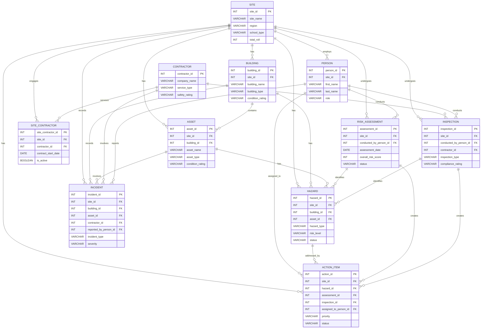

# Data Model - NZ Schools Health & Safety Workshop

## Entity Relationship Diagram

---

## Table Descriptions

### SITE

NZ Schools acting as managed sites for H&S purposes. Sourced from the Ministry of Education school directory.

| Column | Data Type | Description |
|--------|-----------|-------------|
| site_id | INT (PK) | Unique school identifier from the NZ Ministry of Education school number |
| site_name | VARCHAR(200) | Official name of the school |
| street_address | VARCHAR(300) | Physical street address of the school |
| suburb | VARCHAR(100) | Suburb where the school is located |
| town_city | VARCHAR(100) | Town or city where the school is located |
| postal_code | VARCHAR(10) | NZ postal code for the school address |
| latitude | FLOAT | Geographic latitude coordinate (WGS84) |
| longitude | FLOAT | Geographic longitude coordinate (WGS84) |
| location | GEOGRAPHY | Point geometry for geospatial queries, constructed from latitude and longitude (WKT format) |
| region | VARCHAR(100) | NZ Regional Council area (e.g. Auckland Region, Canterbury Region) |
| territorial_authority | VARCHAR(100) | Local territorial authority (district or city council) |
| education_region | VARCHAR(100) | Ministry of Education administrative region |
| urban_rural | VARCHAR(50) | Urban/rural classification (e.g. Main urban area, Rural settlement) |
| school_type | VARCHAR(100) | Type of school (e.g. Primary, Secondary, Composite, Intermediate) |
| school_definition | VARCHAR(200) | Detailed definition of the school type and year levels |
| authority | VARCHAR(50) | Governing authority (State, State-Integrated, Private) |
| total_roll | INT | Total number of enrolled students |
| equity_index | INT | Equity Index (EQI) score indicating socioeconomic context (lower = more disadvantaged) |
| status | VARCHAR(20) | Operational status of the school (Open or Closed) |

---

### BUILDING

Physical buildings within each school site.

| Column | Data Type | Description |
|--------|-----------|-------------|
| building_id | INT (PK) | Unique identifier for the building |
| site_id | INT (FK) | The school this building belongs to |
| building_name | VARCHAR(100) | Descriptive name of the building (e.g. Block A, Main Gymnasium) |
| building_type | VARCHAR(50) | Category of building: CLASSROOM, GYM, LIBRARY, ADMIN, HALL, WORKSHOP, STORAGE, TOILET_BLOCK, SPORTS_PAVILION |
| year_built | INT | Year the building was originally constructed |
| floor_area_sqm | INT | Total floor area of the building in square metres |
| num_floors | INT | Number of storeys in the building |
| condition_rating | VARCHAR(20) | Current assessed condition: GOOD, FAIR, POOR, or CRITICAL |
| last_assessed_date | DATE | Date the building condition was last formally assessed |

---

### ASSET

Physical assets at each school - equipment, infrastructure, vehicles, and grounds features.

| Column | Data Type | Description |
|--------|-----------|-------------|
| asset_id | INT (PK) | Unique identifier for the asset |
| site_id | INT (FK) | The school this asset belongs to |
| building_id | INT (FK) | The building containing the asset (NULL if outdoor/grounds-level) |
| asset_name | VARCHAR(200) | Descriptive name of the asset (e.g. Ride-on Mower #2, Junior Playground) |
| asset_type | VARCHAR(50) | Category: HVAC, ELECTRICAL, PLAYGROUND, VEHICLE, GROUNDS_EQUIPMENT, MACHINERY, CAR_PARK, BUS_STOP, SPORTS_EQUIPMENT, FENCING, ROOFING |
| install_date | DATE | Date the asset was installed or first put into service |
| last_service_date | DATE | Date of the most recent maintenance or servicing |
| condition_rating | VARCHAR(20) | Current assessed condition: GOOD, FAIR, POOR, or CRITICAL |
| is_active | BOOLEAN | Whether the asset is currently in active use (FALSE if decommissioned) |

---

### PERSON

Synthetic staff responsible for H&S duties at each school - owners and assignees of actions and assessments.

| Column | Data Type | Description |
|--------|-----------|-------------|
| person_id | INT (PK) | Unique identifier for the person |
| site_id | INT (FK) | The school where this person is primarily based |
| first_name | VARCHAR(50) | First name of the person (synthetic) |
| last_name | VARCHAR(50) | Last name of the person (synthetic) |
| role | VARCHAR(50) | H&S role at the school: PRINCIPAL, SITE_MANAGER, HS_REP, or CARETAKER |
| email | VARCHAR(200) | Work email address (synthetic) |
| phone | VARCHAR(20) | Contact phone number (synthetic) |
| start_date | DATE | Date the person started in this role at the school |
| is_active | BOOLEAN | Whether the person is currently active in this role |

---

### CONTRACTOR

Synthetic contractor companies providing maintenance, construction, and specialist services to schools.

| Column | Data Type | Description |
|--------|-----------|-------------|
| contractor_id | INT (PK) | Unique identifier for the contractor company |
| company_name | VARCHAR(200) | Name of the contractor company (synthetic) |
| service_type | VARCHAR(50) | Primary service category: BUILDING_MAINTENANCE, ELECTRICAL, PLUMBING, CLEANING, GROUNDS, IT_SERVICES, PAINTING, ROOFING, SECURITY, HVAC |
| region | VARCHAR(100) | Primary NZ region where the contractor operates |
| certification_expiry | DATE | Date when the contractor safety certification expires |
| is_active | BOOLEAN | Whether the contractor is currently active and available for work |
| safety_rating | VARCHAR(5) | Overall safety performance rating: A (best) through D (worst) |

---

### SITE_CONTRACTOR

Junction table linking contractor companies to the school sites they service.

| Column | Data Type | Description |
|--------|-----------|-------------|
| site_contractor_id | INT (PK) | Unique identifier for this site-contractor relationship |
| site_id | INT (FK) | The school being serviced |
| contractor_id | INT (FK) | The company providing the service |
| contract_start_date | DATE | Date the contract between the school and contractor commenced |
| contract_end_date | DATE | Date the contract ended (NULL if still active) |
| is_active | BOOLEAN | Whether this contract is currently active |

---

### HAZARD

Hazard register - known workplace risks at each school site including building, asset, and environmental hazards.

| Column | Data Type | Description |
|--------|-----------|-------------|
| hazard_id | INT (PK) | Unique identifier for the hazard |
| site_id | INT (FK) | The school where this hazard exists |
| building_id | INT (FK) | The building (NULL if hazard relates to the physical environment) |
| asset_id | INT (FK) | The asset (NULL if not related to a specific asset) |
| hazard_type | VARCHAR(50) | Broad hazard classification: PHYSICAL, CHEMICAL, BIOLOGICAL, ERGONOMIC, ENVIRONMENTAL, ELECTRICAL, STRUCTURAL |
| hazard_category | VARCHAR(50) | Specific hazard category: SLIP_TRIP_FALL, FALLING_OBJECTS, MACHINERY, TRAFFIC, WEATHER, ASBESTOS, WATER, TREES, PLAYGROUND, ELECTRICAL, HEIGHTS |
| description | VARCHAR(2000) | Detailed free-text description of the hazard and its context |
| location_description | VARCHAR(500) | Specific location of the hazard within the school grounds |
| risk_level | VARCHAR(20) | Assessed risk level: LOW, MEDIUM, HIGH, or CRITICAL |
| status | VARCHAR(20) | Current hazard status: OPEN, CONTROLLED, ELIMINATED, or MONITORING |
| identified_date | DATE | Date the hazard was first identified |
| identified_by_assessment_id | INT (FK) | The risk assessment that found this hazard (if applicable) |
| identified_by_inspection_id | INT (FK) | The inspection that found this hazard (if applicable) |
| control_measures | VARCHAR(2000) | Description of control measures applied to manage the hazard |

---

### INCIDENT

Workplace incidents across all school sites including injuries, near-misses, property damage, and security events.

| Column | Data Type | Description |
|--------|-----------|-------------|
| incident_id | INT (PK) | Unique identifier for the incident |
| site_id | INT (FK) | The school where the incident occurred |
| building_id | INT (FK) | The building (NULL if incident occurred outdoors) |
| asset_id | INT (FK) | The asset involved (NULL if no specific asset was involved) |
| contractor_id | INT (FK) | The contractor involved (NULL if no contractor was involved) |
| reported_by_person_id | INT (FK) | The staff member who reported the incident |
| incident_date | TIMESTAMP_NTZ | Date and time when the incident occurred |
| reported_date | TIMESTAMP_NTZ | Date and time when the incident was formally reported |
| incident_type | VARCHAR(30) | Classification: INJURY, NEAR_MISS, PROPERTY_DAMAGE, ENVIRONMENTAL, or SECURITY |
| severity | VARCHAR(20) | Severity level: MINOR, MODERATE, SERIOUS_HARM, or NOTIFIABLE |
| body_part_affected | VARCHAR(30) | Body part injured: HEAD, BACK, HAND, LEG, FOOT, ARM, SHOULDER, KNEE, MULTIPLE, or NA |
| activity_at_time | VARCHAR(30) | Activity being performed: TEACHING, MAINTENANCE, SPORT, TRANSIT, CLEANING, CONSTRUCTION, PLAY, ADMIN |
| location_type | VARCHAR(30) | Location type: INDOOR, OUTDOOR, CARPARK, PLAYGROUND, SPORTS_FIELD, STAIRWELL, WORKSHOP, KITCHEN |
| narrative | VARCHAR(4000) | Free-text description of the incident including circumstances and response |
| root_cause_category | VARCHAR(30) | Root cause: HUMAN_ERROR, EQUIPMENT_FAILURE, ENVIRONMENTAL, PROCEDURAL, or TRAINING_GAP |
| corrective_action_taken | VARCHAR(2000) | Description of immediate corrective actions taken |
| investigation_status | VARCHAR(20) | Investigation status: OPEN, IN_PROGRESS, or CLOSED |
| days_lost | INT | Number of work/school days lost (0 for near-misses) |
| involves_contractor | BOOLEAN | Whether a contractor was involved in the incident |

---

### RISK_ASSESSMENT

Scheduled risk assessments conducted twice per year (H1 and H2) at each school site.

| Column | Data Type | Description |
|--------|-----------|-------------|
| assessment_id | INT (PK) | Unique identifier for the risk assessment |
| site_id | INT (FK) | The school being assessed |
| conducted_by_person_id | INT (FK) | The staff member who conducted the assessment |
| assessment_date | DATE | Date the risk assessment was carried out on site |
| assessment_period | VARCHAR(10) | Half-year period identifier (e.g. H1_2021, H2_2021) |
| overall_risk_score | INT | Composite risk score from 1 (lowest) to 100 (highest risk) |
| findings_summary | VARCHAR(4000) | Free-text summary of key findings and recommendations |
| num_hazards_identified | INT | Count of new hazards identified during this assessment |
| num_actions_created | INT | Count of corrective action items created |
| status | VARCHAR(20) | Assessment workflow status: DRAFT, COMPLETED, or REVIEWED |

---

### INSPECTION

Ad-hoc site inspections including routine visits, post-incident reviews, contractor audits, and complaint responses.

| Column | Data Type | Description |
|--------|-----------|-------------|
| inspection_id | INT (PK) | Unique identifier for the inspection |
| site_id | INT (FK) | The school being inspected |
| conducted_by_person_id | INT (FK) | The staff member who conducted the inspection |
| contractor_id | INT (FK) | The contractor (populated when this is a contractor safety audit) |
| inspection_date | DATE | Date the inspection was carried out |
| inspection_type | VARCHAR(30) | Type: ROUTINE, POST_INCIDENT, CONTRACTOR_AUDIT, or COMPLAINT_RESPONSE |
| field_notes | VARCHAR(4000) | Unstructured field notes written during the site visit |
| compliance_rating | VARCHAR(30) | Compliance outcome: COMPLIANT, MINOR_NON_COMPLIANCE, MAJOR_NON_COMPLIANCE, or CRITICAL |
| num_hazards_identified | INT | Count of new hazards identified during this inspection |
| num_actions_created | INT | Count of corrective action items created |
| status | VARCHAR(20) | Inspection workflow status: DRAFT, COMPLETED, or REVIEWED |

---

### ACTION_ITEM

Corrective actions arising from risk assessments, inspections, and hazards with ownership and due date tracking.

| Column | Data Type | Description |
|--------|-----------|-------------|
| action_id | INT (PK) | Unique identifier for the action item |
| site_id | INT (FK) | The school where this action applies |
| hazard_id | INT (FK) | The hazard this action addresses (if applicable) |
| assessment_id | INT (FK) | The assessment that created this action (if applicable) |
| inspection_id | INT (FK) | The inspection that created this action (if applicable) |
| assigned_to_person_id | INT (FK) | The staff member responsible for completing this action |
| action_description | VARCHAR(2000) | Description of the corrective action required |
| priority | VARCHAR(20) | Priority level: LOW, MEDIUM, HIGH, or CRITICAL |
| due_date | DATE | Target date by which the action must be completed |
| completed_date | DATE | Actual completion date (NULL if still open) |
| status | VARCHAR(20) | Current status: OPEN, IN_PROGRESS, OVERDUE, COMPLETED, or CANCELLED |
| created_date | DATE | Date the action item was created |
| notes | VARCHAR(2000) | Additional notes or updates on progress |
